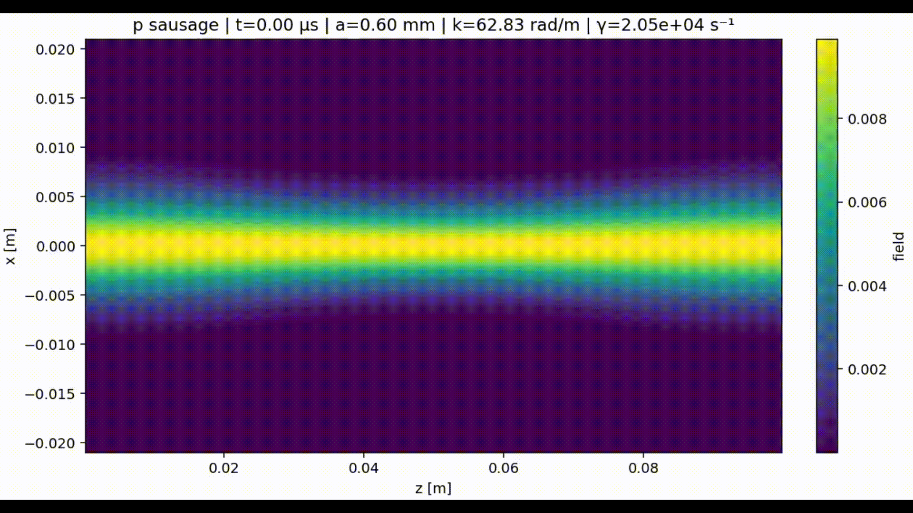
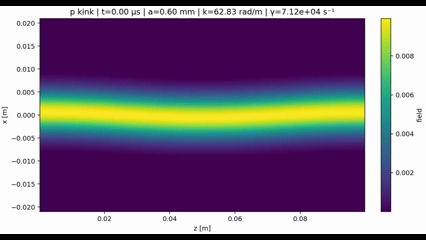
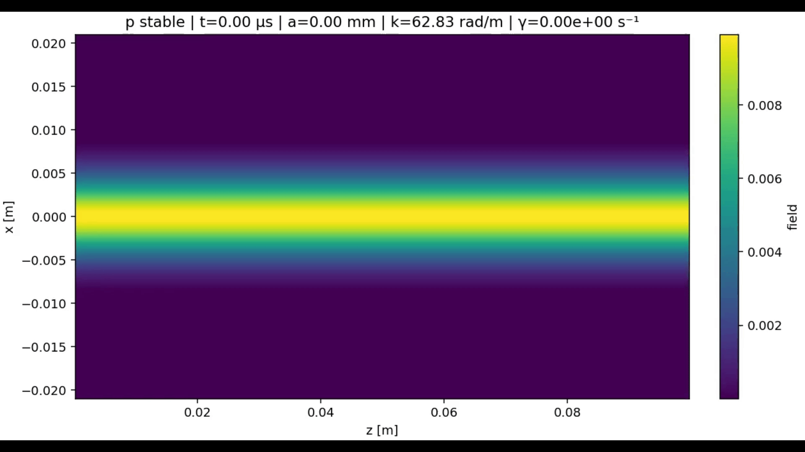

# ZPinchSim — Minimal Resistive MHD Z‑Pinch Simulator (C++17)  

  

---

## Overview

**ZPinchSim** is a lightweight, research‑oriented codebase to study the linear and weakly nonlinear evolution of the **Z‑pinch** in cylindrical geometry. It solves a **resistive MHD** model on an $ (r,z) $ grid with cylindrical source terms, an azimuthal magnetic field $ B_\theta $ generated by axial current, and optional guide field $ B_z $. The code is designed to analyze and visualize the onset and evolution of the canonical **$m=0$ (sausage)** and **$m=1$ (kink)** modes using performant C++ numerics and a Python post‑processing pipeline.

Why this tool?
- **Pedagogical clarity** with production‑grade numerics (finite‑volume + CT).
- **Fast iteration**: simple YAML configs, compact binary, CSV snapshots.
- **Diagnostics‑first**: growth rates, energies, and mode amplitudes out of the box.
- **Pseudo‑3D awareness**: projections for $m=1$ content from $(r,z)$ fields.

---

## Physics Background (What is a Z‑pinch and why it destabilizes?)

A **Z‑pinch** confines plasma with its **self‑generated azimuthal field** $ B_\theta(r) $ due to an axial current $ I_z $. The Lorentz force density $ J_z \times B_\theta $ produces an **inward magnetic pressure** (``pinch'') that compresses the column. In ideal MHD, radial force balance reads
$$
\frac{dp}{dr} + \frac{B_\theta}{\mu_0}\frac{d B_\theta}{dr} + \frac{B_\theta^2}{\mu_0\,r} = 0,
$$
where $p$ is the thermal pressure and $\mu_0$ the vacuum permeability. Equilibria exist with $p(r)$ decreasing outward and $B_\theta(r)$ peaked near an edge scale $R_0$.

However, Z‑pinches are prone to two archetypal **current‑driven instabilities**:

- **Sausage ($m=0$)**: axisymmetric modulation of column radius; segments thin and thicken, altering line density and magnetic pressure. It’s mainly a **compressional** mode and can disrupt via necking.
- **Kink ($m=1$)**: helical transverse displacement of the column; the entire filament “snakes.” It’s primarily a **transverse** instability, sensitive to current profile and line‑tying.

Sheared axial flow $v_z(r)$ is known to **stabilize or delay** these modes by phase‑mixing. PIC simulations (e.g., Tummel *et al.* 2019) show sausage suppression with **subsonic** sheared flows, complementing and extending fluid‑MHD expectations.

---

## Governing Equations (Resistive MHD in $(r,z)$ with axisymmetry)

We solve single‑fluid resistive MHD in cylindrical coordinates, with primitive variables
$W=(\rho, v_r, v_z, p, B_r, B_z, B_\theta)$. Ideal‑gas closure $p=(\gamma-1)\,e_\mathrm{int}$.

**Continuity**
$$
\partial_t \rho + \nabla\!\cdot(\rho \mathbf{v}) = 0.
$$

**Momentum (radial and axial)**  
$$
\partial_t(\rho \mathbf{v}) + \nabla\!\cdot\!\left[\rho \mathbf{v}\mathbf{v} + \left(p+\frac{B^2}{2\mu_0}\right)\! \mathbf{I} - \frac{\mathbf{B}\mathbf{B}}{\mu_0}\right] = \mathbf{S}_\mathrm{cyl},
$$
with cylindrical source terms near $r=0$ (e.g., $B_\theta^2/r$ contributions) treated in a well‑balanced way.

**Induction (Constrained Transport for $B_r,B_z$)**  
$$
\partial_t \mathbf{B} = -\nabla \times \mathbf{E},\qquad \mathbf{E} = -\mathbf{v}\times\mathbf{B} + \eta \,\mathbf{J},\quad \mathbf{J}=\frac{1}{\mu_0}\nabla\times\mathbf{B}.
$$

**Azimuthal field $B_\theta$ update (axisymmetric advection–diffusion form)**  
Discretized as a conservative advection in $(r,z)$ plus a resistive operator consistent with cylindrical geometry:
$$
\partial_t B_\theta + \nabla\!\cdot(B_\theta \mathbf{v}_{rz}) + \frac{v_r}{r} B_\theta = \eta\,\left[\frac{1}{r}\partial_r\!\left(r\,\partial_r B_\theta\right) - \frac{B_\theta}{r^2} + \partial_{zz} B_\theta\right].
$$

**Energy** (toy‑model internal energy handled via $p$; magnetic/kinetic diagnostics in Python).

**Equilibrium builder**: initial $B_\theta(r)$ and $p(r)$ satisfy radial force balance approximately, with mild smoothing to suppress numerical ringing. Optional guide field $B_z=B_{z0}$. Optional **sheared axial flow** $v_z(r)$ injected after initialization.

---

## What Each Numerical Component Contributes

- **Finite Volume (FV) + MUSCL reconstruction (2nd‑order)**  
  Reconstructs left/right states at interfaces with TVD limiters (Minmod/MC) to reduce spurious oscillations near sharp gradients (e.g., forming necks in sausage).  
  *Impact:* keeps the solution non‑oscillatory and accurate in smooth regions—essential to measure growth rates reliably.

- **Approximate Riemann solvers (HLL in $r$ and $z$)**  
  Supplies physically consistent **fluxes** at cell faces. HLL is robust for mixed fast/Alfvénic waves and avoids odd–even decoupling.  
  *Impact:* well‑behaved shock/rarefaction handling and stable time stepping across all regimes explored.

- **Constrained Transport (CT) for $(B_r,B_z)$**  
  Updates magnetic flux with a staggered **electromotive field** $E_\theta$ so that the discrete divergence of $(B_r,B_z)$ remains near machine precision.  
  *Impact:* preserves $\nabla\!\cdot\mathbf{B}\approx0$, preventing spurious forces that would fake or mask instabilities.

- **Axisymmetric $B_\theta$ operator**  
  Dedicated advection–diffusion update consistent with cylindrical geometry and optional resistivity $\eta_\theta$.  
  *Impact:* permits clean studies of current‑driven modes while controlling numerical dissipation separately from CT.

- **Cylindrical source terms (well‑balanced)**  
  Special handling of $1/r$ terms (e.g., $B_\theta^2/r$ in radial momentum).  
  *Impact:* maintains near‑equilibrium cores without artificial motion, improving signal‑to‑noise of growing modes.

- **Boundary Conditions**  
  - **Axis $r=0$**: symmetry on scalars, $v_r=0$, $B_r=0$, consistent extrapolation for others.  
  - **Outer $r=R_\text{max}$**: reflective/solid‑wall for velocities, copying for scalars; fields handled to avoid artificial currents.  
  - **$z$ boundaries**: periodic or **sponge** layers (exponential damping) to absorb outgoing content.  
  *Impact:* prevents non‑physical reflections that would corrupt growth‑rate fits and spatial spectra.

- **Kreiss–Oliger (KO) edge filter**  
  A gentle high‑order smoother applied only near domain edges.  
  *Impact:* tames grid‑scale noise seeded at boundaries without degrading interior dynamics.

- **CFL time step and velocity cap**  
  $dt \le \text{CFL}\cdot \min(dr,dz)/c_\text{fast}$ using a conservative fast‑magnetosonic estimate $c_f=\sqrt{c_s^2+v_A^2}$, with an optional cap on apparent wave speed.  
  *Impact:* stable, predictable stepping and performance across parameter scans.

- **Mode seeding ($m=0$ or $m=1$)**  
  Controlled perturbations $\,\propto \cos(k z)$ (sausage) or $m=1$ content via side fields.  
  *Impact:* reproducible linear growth rates and mode identification.

---

## Project Layout

```
ZPinchSim/
├─ configs/            # YAML runs: kink.yaml, sausage.yaml, stable.yaml, helper.yaml
├─ include/            # Doxygen-documented headers (grid, state, physics, rsolver, io, utils, reconstruction)
├─ src/                # Implementations (physics.cpp is deeply documented)
├─ pyscripts/          # Python tools: utils.py, diagnostics.py, viz.py
├─ CMakeLists.txt
├─ LICENSE
└─ README.md
```

---

## Build (Windows/Linux/macOS)

```bash
# Configure and build
mkdir build && cd build
cmake ..
cmake --build . --config Release -j

# Run (examples)
./zpinch_run ../configs/kink.yaml
./zpinch_run ../configs/sausage.yaml
./zpinch_run ../configs/stable.yaml
# or a custom file
./zpinch_run ../configs/custom.yaml
```

On Windows with the provided paths:
```
.\zpinch_run.exe .\configs\kink.yaml
.\zpinch_run.exe .\configs\sausage.yaml
.\zpinch_run.exe .\configs\stable.yaml
.\zpinch_run.exe .\configs\custom.yaml
```

Output is written to `data/<run_name>/` as CSV snapshots plus minimal metadata.

---

## Execution Flow (What happens during a run)

1. **Grid + Config**: domain $(0\le r\le R_\text{max}, 0\le z\le Z_\text{max})$, guards, limiters, CFL, resistivities, BCs are read from YAML.  
2. **Equilibrium Builder**: constructs $B_\theta(r)$ and $p(r)$ satisfying approximate radial force balance; adds uniform $B_{z0}$ if requested.  
3. **Optional Shear Flow**: injects $v_z(r)$ (linear or localized Gaussian) to test shear‑stabilization hypotheses.  
4. **Mode Seeding**: small perturbations at wavenumber $k$ (sausage/kink).  
5. **Time Integration Loop** (per step):  
   - Reconstruct MUSCL states; compute HLL fluxes (radial and axial sweeps).  
   - CT update for $(B_r,B_z)$ via $E_\theta = -(v_r B_z - v_z B_r) + \eta_\text{ct}(\partial_r B_z - \partial_z B_r)$.  
   - Axisymmetric $B_\theta$ advection–diffusion update.  
   - Apply cylindrical sources, KO edge filter, BCs, and optional sponge.  
   - Half‑step corrector pass (SSP‑RK2‑like) with the same phases.  
6. **I/O**: snapshots every `output_every` steps; diagnostics CSV for lightweight monitoring.  
7. **Finish**: final snapshot, metrics flush, concise summary on stderr/stdout.

---

## Python Tooling

Before using the Python tools, run the utility installer once (creates/activates a venv and installs requirements if missing):

```bash
python pyscripts/utils.py --bootstrap
```

### 1) Diagnostics

Detects dominant $k$, computes amplitude $A_k(t)$ for pressure/density/etc., fits $\ln A_k$ to extract a growth rate $\gamma$, and integrates volume energies.

**Recommended commands**

```bash
# Sausage (m=0), 2.5D dataset
python pyscripts/diagnostics.py --run-dir .\data\sausage_m0_2p5d --field p --mode volume --demean-z --save-spectrum

# Kink (m=1), 2.5D dataset
python pyscripts\diagnostics.py --run-dir .\data\kink_m1_2p5d --field p --mode volume --demean-z --save-spectrum

# Stable reference
python pyscripts\diagnostics.py --run-dir .\data\stable_ref_2p5d --field p --mode volume --demean-z --save-spectrum
```

Outputs:
- `diagnostics_Ak.csv`, `diagnostics_energy.csv`
- optional `diagnostics_fit_gamma.csv` with best‑fit $\gamma$ and window
- `diagnostics_lnA_fit.png` when a fit succeeds
- `diagnostics_spectrum_k.csv` if $k$ is auto‑detected

### 2) Visualization / Mode‑aware rendering

Synthesizes **kink/sausage/stable** visualizations and optional MP4s by re‑mapping the $(r,z)$ fields to a transverse cut with a time‑dependent amplitude $a(t)$ (exponential or generalized logistic).

**Recommended commands**

```bash
# Sausage movie (auto logistic growth, softer clamp in radius)
python pyscripts/viz.py --run-dir ./data/sausage_m0_2p5d --field p --mode auto --amp-mode auto-logistic \
  --logistic-power 1.8 --a-sat-frac 0.65 --sausage-bounds 0.60 1.60 --sausage-ksoft 6.0 --sausage-beta 0.95 \
  --make-mp4 --fps 24

# Kink movies (two presets)
python pyscripts/viz.py --run-dir ./data/kink_m1_2p5d --field p --mode auto --amp-mode auto-logistic \
  --logistic-power 1.6 --a-sat-frac 0.60 --make-mp4 --fps 24

python pyscripts\viz.py --run-dir .\data\kink_m1_2p5d --field p --mode auto --amp-mode auto-logistic \
  --a-sat-frac 0.5 --make-mp4 --fps 24

# Stable reference (no growth)
python pyscripts\viz.py --run-dir .\data\stable_ref_2p5d --field p --mode stable --make-mp4 --fps 24
```

Artifacts:
- `viz_{field}_{mode}.mp4` (if `--make-mp4`), and `viz_{field}_{mode}_last.png`

---

## Interpreting the Diagnostics

- **$A_k(t)$ growth**: in the linear stage, $A_k(t)\sim e^{\gamma t}$ so $\ln A_k$ is a straight line. The fitter reports $\gamma$, window $[t_\text{min},t_\text{max}]$, and $R^2$.  
- **Energies**: volume integrals of magnetic ($E_B$), kinetic ($E_K$), and internal ($E_\mathrm{int}$) proxies help identify transfers during onset/saturation.  
- **Effect of shear**: enabling a radial shear in $v_z(r)$ should reduce $\gamma_{m=0}$ and can modify $m=1$ depending on profiles (qualitative agreement with kinetic results).

---

## Example Results (place your GIFs here)

> Put your animated GIFs in `src/sausage.gif`, `src/kink.gif`, and `src/stable.gif` and reference them here.

- **Sausage ($m=0$)**  
    
  Axisymmetric necking/bulging; strong modulation of cross‑section and axial magnetic pressure. Growth rate $\gamma$ from $A_k(t)$ should be clearly exponential before saturation.

- **Kink ($m=1$)**  
    
  Helical centerline displacement; column “snakes” along $z$. Diagnostics show transverse motion with comparatively weaker compression.

- **Stable Reference**  
    
  Equilibrium persists; perturbations are either absent or damped by resistivity/sponge/shear.

---

## Limitations & Assumptions

- Single‑fluid resistive MHD (no two‑fluid/Hall/kinetic effects).  
- Simplified energy handling; radiative and viscous terms omitted.  
- Axisymmetric base fields with pseudo‑3D $m=1$ projection for visualization/diagnostics.  
- Intended for linear/early‑nonlinear exploration; not a reactor design tool.

---

## Validation Ideas

- **Brio–Wu** shock tube along $z$: verify FV+HLL+limiter performance.  
- **Equilibrium hold**: run with no seeds, check $L_2$ residual of radial balance and $\nabla\!\cdot \mathbf{B}$.  
- **Resolution study**: confirm $\gamma$ convergence with $(N_r,N_z)$.  
- **Shear scans**: varying $dv_z/dr$ to reproduce trends in sausage suppression.

---

## References

- K. Tummel *et al.*, “Kinetic simulations of sheared flow stabilization in high‑temperature Z‑pinch plasmas,” *Physics of Plasmas* **26**, 062506 (2019). https://doi.org/10.1063/1.5092241  
- J. P. Freidberg, *Ideal MHD* (Cambridge Univ. Press, 2014).  
- F. F. Chen, *Introduction to Plasma Physics and Controlled Fusion* (Springer, 2016).

---

## Acknowledgements

Authored and maintained by **Juan Pablo Solís Ruiz**. Contributions welcome. MIT License.

---

## Quick Command Recap

```
# Run helpers (see configs/helper.yaml)
.\zpinch_run.exe .\configs\kink.yaml
.\zpinch_run.exe .\configs\sausage.yaml
.\zpinch_run.exe .\configs\stable.yaml
.\zpinch_run.exe .\configs\custom.yaml

# Diagnostics (sausage/kink/stable)
python pyscripts\diagnostics.py --run-dir .\data\sausage_m0_2p5d --field p --mode volume --demean-z --save-spectrum
python pyscripts\diagnostics.py --run-dir .\data\kink_m1_2p5d    --field p --mode volume --demean-z --save-spectrum
python pyscripts\diagnostics.py --run-dir .\data\stable_ref_2p5d --field p --mode volume --demean-z --save-spectrum

# Visualization presets
python pyscripts/viz.py --run-dir ./data/sausage_m0_2p5d --field p --mode auto --amp-mode auto-logistic --logistic-power 1.8 --a-sat-frac 0.65 --sausage-bounds 0.60 1.60 --sausage-ksoft 6.0 --sausage-beta 0.95 --make-mp4 --fps 24
python pyscripts\viz.py --run-dir .\data\kink_m1_2p5d    --field p --mode auto --amp-mode auto-logistic --a-sat-frac 0.5 --make-mp4 --fps 24
python pyscripts\viz.py --run-dir .\data\stable_ref_2p5d --field p --mode stable --make-mp4 --fps 24
```

